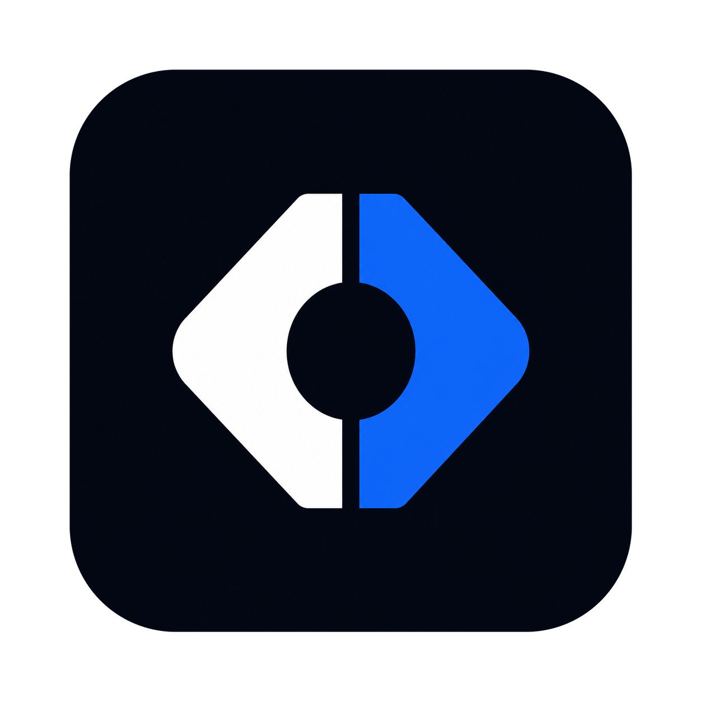

<p align="center">
  
</p>

# KeenCode

一款轻量、本地优先的开源桌面 AI 编码工具。

[](https://github.com/chengliang4810/keen-code/actions/workflows/ci.yml)
[](https://github.com/chengliang4810/keen-code/releases/latest)
[](LICENSE)

KeenCode 面向个人开发者，把项目管理、AI 编码对话、文件修改、终端命令、Diff、Git 操作和扩展管理放进一个专注的桌面工作台。应用与工作区状态均运行在本机，不依赖必须部署的配套 Web 服务。

## 主要能力

- 打开和管理本地代码项目。
- 在同一项目中创建多个对话，并让不同对话并行运行。
- 搜索、读取和修改文件，查看可审查的差异。
- 执行终端命令并保留完整过程与结果。
- 查看基础 Git 状态、Diff，并辅助提交与推送。
- 配置自定义模型供应商，不绑定单一厂商。
- 使用项目级 Goal、会话级 Todo 与单层子智能体。
- 通过插件市场、Skills 和 MCP 扩展本地工作流。
- 默认把项目、会话、配置和执行记录保存在当前设备。

## 下载与安装

从 [GitHub Releases](https://github.com/chengliang4810/keen-code/releases/latest) 下载最新版本：

- macOS Apple Silicon：选择名称中包含 `darwin` 与 `aarch64` 的 DMG。
- macOS Intel：选择名称中包含 `darwin` 与 `x64` 的 DMG。
- Windows 64 位：推荐下载名称中包含 `windows`、`x64` 与 `setup.exe` 的安装包。

当前发布范围仅包含 macOS 和 Windows。

KeenCode 启动后会立即检查 GitHub Releases，并在运行期间每 30 分钟静默复查；也可以在「设置 → 关于」中手动检查。应用只安装通过发布签名校验的更新，下载和安装完成后会自动重启。

> 首次公开测试版本可能尚未配置 Apple 或 Windows 商业代码签名证书，操作系统可能显示来源提示。应用内更新签名与操作系统代码签名是两套独立校验。

## 使用前配置

首次使用时，在「设置 → 模型设置」中添加自己的模型供应商、API 地址、密钥和模型。密钥只保存在 KeenCode 本机应用配置中。

加入项目即授予应用及 Agent 进程按当前系统用户权限工作的能力。文件修改、命令执行和网络访问不会逐次弹出审批框，请在发送任务前确认项目目录和指令范围，并在执行后审查工具记录与 Diff。

## 本地开发

需要 Node.js 20、pnpm 10.14.0、Rust stable，以及 Tauri 2 对应平台的系统构建工具。

```bash
git clone https://github.com/chengliang4810/keen-code.git
cd keen-code
corepack pnpm@10.14.0 install --frozen-lockfile
corepack pnpm@10.14.0 dev:desktop
```

常用检查：

```bash
corepack pnpm@10.14.0 typecheck
corepack pnpm@10.14.0 test
corepack pnpm@10.14.0 build
(cd src-tauri && cargo test)
```

生成本机安装包：

```bash
corepack pnpm@10.14.0 build:desktop
```

## 发布与版本

每次推送到 `main`，GitHub Actions 会先运行前端检查，再原生构建以下安装包：

- macOS Apple Silicon
- macOS Intel
- Windows x64

全部平台成功后才会公开 Release，并生成应用内更新所需的 `latest.json` 与签名产物。

对外 Release 标签采用日期与提交短哈希：

```text
vYYYYMMDD-abcdef0
```

例如：`v20260730-49ad19b`。安装包内部使用可排序的三段数字版本，以满足更新比较以及 macOS、Windows 原生版本字段要求；界面始终展示对外 Release 标签。

维护者发布说明见 [docs/releasing.md](docs/releasing.md)。

## 数据与隐私

- 项目文件、会话状态、扩展配置和工具记录默认保存在本机。
- KeenCode 不提供必须经过的云端中转服务。
- 只有用户配置的模型服务、MCP Server、插件来源或任务主动访问的地址会产生网络请求。
- 项目不默认启用遥测或上传用户代码。

## 许可证

KeenCode 自有代码采用 [MIT License](LICENSE)。仓库包含的第三方源码继续遵循各自许可证，版权与修改声明见 [THIRD_PARTY_NOTICES.md](THIRD_PARTY_NOTICES.md)。
